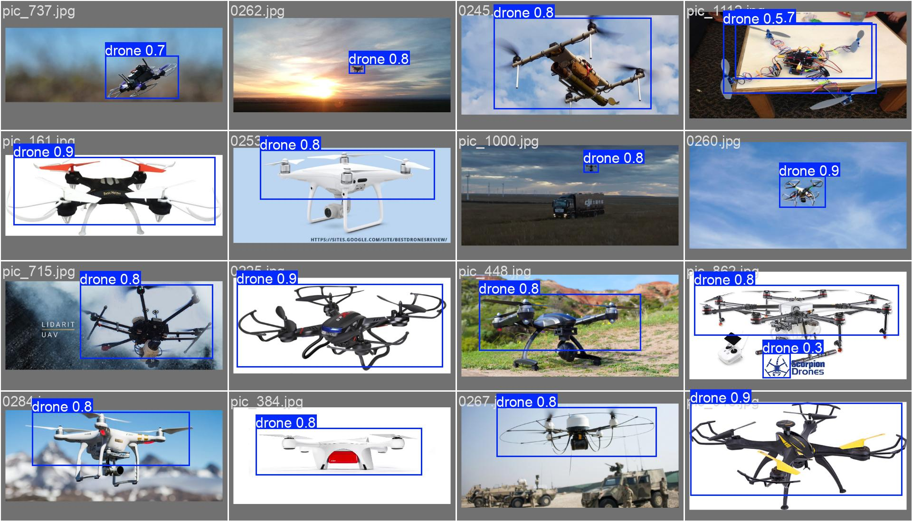
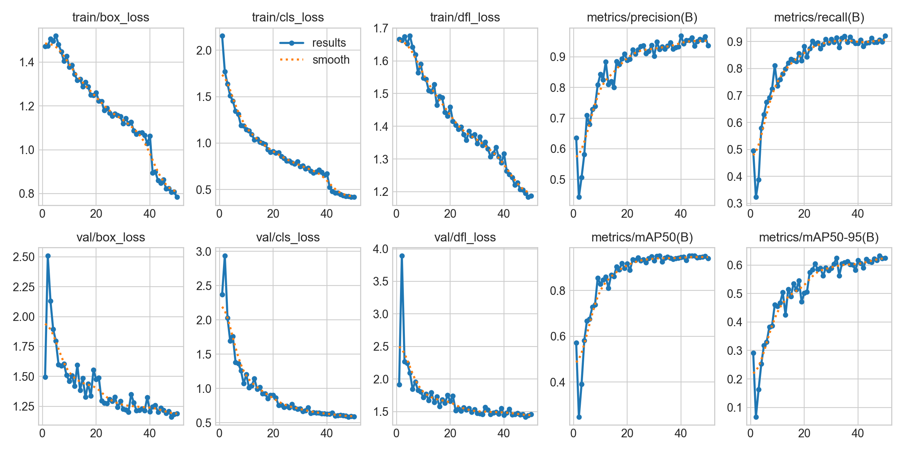
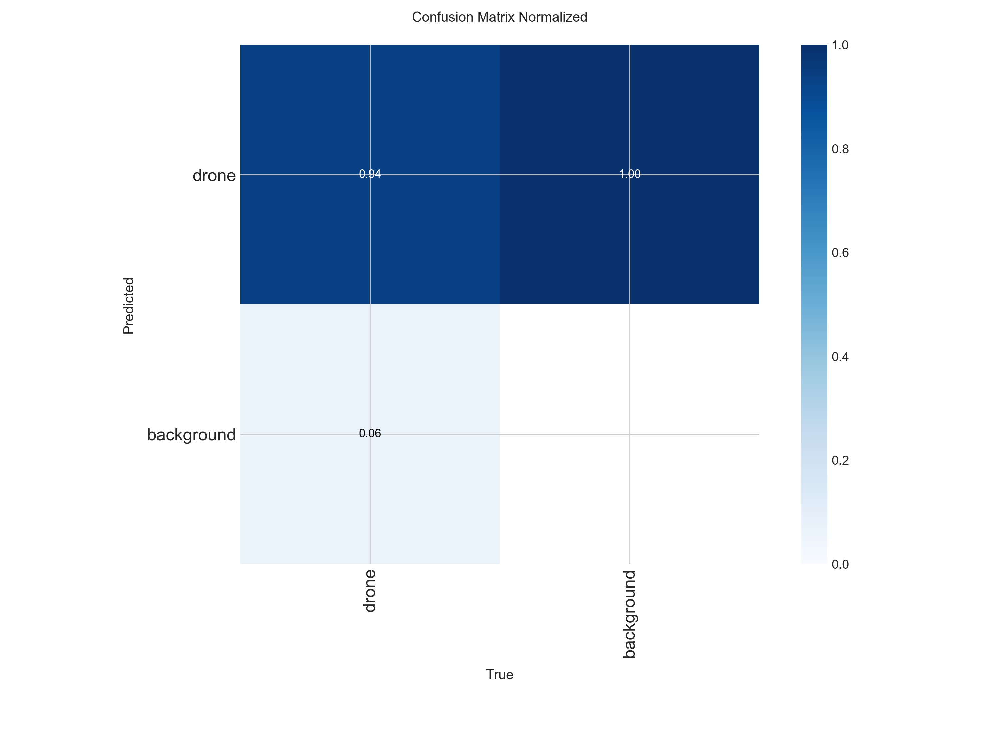
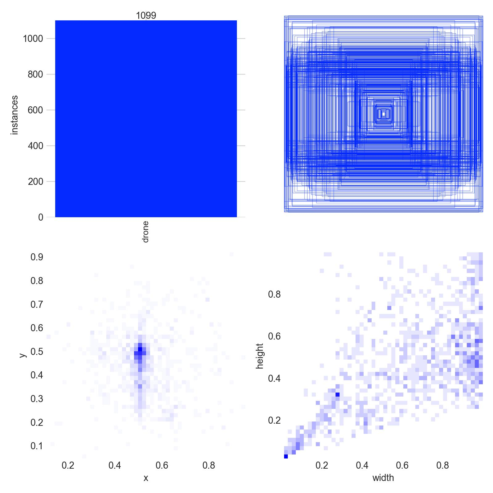
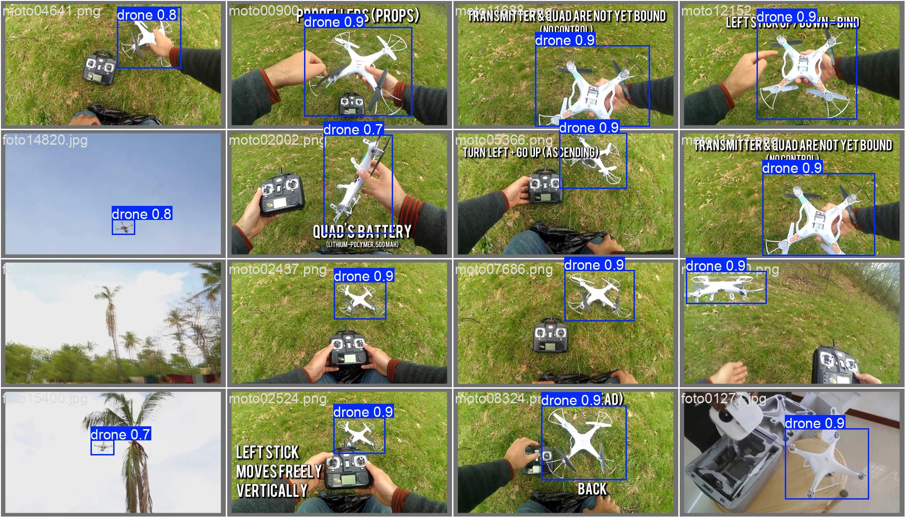

# Drone Detection Using YOLO

This project prepares a drone detection dataset, evaluates multiple trained YOLO models, and provides a Streamlit app for side-by-side inference comparison.

## Project Preview

This repository is built as a practical drone detection pipeline: from dataset inspection and annotation cleaning to trained-model comparison and deployable visual inference.

<p align="center">
    
</p>

<p align="center">
    Final recommended model: <strong>YOLOv8n</strong> for the best deployment balance between speed, memory usage, and detection quality in this project.
</p>

## Visual Results

The visuals below come from the trained `yolov8n` experiment and help present the project as a complete, production-oriented computer vision workflow.

<p align="center">
    
    
</p>

<p align="center">
    
    
</p>

These figures show:

- qualitative detection output on validation images
- training behavior across epochs
- class-level validation behavior through the confusion matrix
- dataset annotation distribution used by the final pipeline

## Project Scope

The workflow in this repository covers:

- dataset exploration and annotation comparison in `EDA.ipynb`
- merged YOLO-format dataset generation under `data/merged_drone_dataset_yolo`
- training and evaluation utilities in `training.ipynb`
- comparison of four trained YOLO models
- a Streamlit app for visual inference comparison on a single uploaded image

The project is configured to use the existing `dl_venv` environment and can run inference on CUDA when available.

## Repository Structure

```text
drone_detection/
|-- EDA.ipynb
|-- training.ipynb
|-- streamlit_app.py
|-- requirements.txt
|-- data/
|   |-- merged_drone_dataset_yolo/
|-- runs/
|   |-- drone_object_detection_yolo11n_img640_e50/
|   |-- drone_object_detection_yolo11s_img640_e50/
|   |-- drone_object_detection_yolov8n_img640_e50/
|   |-- drone_object_detection_yolov8s_img640_e50/
|-- outputs/
    |-- predictions/
    |-- streamlit_results/
```

## Dataset Workflow

The dataset work was finalized in YOLO format.

- XML and YOLO annotations were explored and compared in `EDA.ipynb`
- the usable samples were merged into one YOLO dataset
- the merged dataset was split into train, validation, and test sets
- the final dataset configuration is stored in `data/merged_drone_dataset_yolo/dataset.yaml`

This makes the dataset directly usable with Ultralytics YOLO training, validation, and prediction commands.

## Trained Models

The repository currently uses four trained YOLO models stored under `runs/`:

### 1. YOLO11n

- Run folder: `runs/drone_object_detection_yolo11n_img640_e50`
- Weight file: `runs/drone_object_detection_yolo11n_img640_e50/weights/best.pt`
- Profile: smallest and fastest YOLO11 variant in this project
- Use case: low-latency inference and limited hardware

### 2. YOLO11s

- Run folder: `runs/drone_object_detection_yolo11s_img640_e50`
- Weight file: `runs/drone_object_detection_yolo11s_img640_e50/weights/best.pt`
- Profile: larger than YOLO11n with a typical speed vs. accuracy tradeoff
- Use case: when a little more capacity is acceptable

### 3. YOLOv8n

- Run folder: `runs/drone_object_detection_yolov8n_img640_e50`
- Weight file: `runs/drone_object_detection_yolov8n_img640_e50/weights/best.pt`
- Profile: lightweight YOLOv8 model
- Use case: selected final model for this project after evaluation and comparison

### 4. YOLOv8s

- Run folder: `runs/drone_object_detection_yolov8s_img640_e50`
- Weight file: `runs/drone_object_detection_yolov8s_img640_e50/weights/best.pt`
- Profile: larger YOLOv8 variant with higher compute cost
- Use case: comparison against the lightweight variants

## Recommended Model

`yolov8n` is the recommended model for this project.

Reasoning:

- it is lightweight enough for constrained GPU memory
- it performed well in the project comparison workflow
- it is the most practical final model for deployment and demo usage

## Environment Setup

Use the existing environment in `dl_venv`.

Install dependencies if needed:

```powershell
dl_venv\python.exe -m pip install -r requirements.txt
```

Key dependencies:

- `ultralytics`
- `torch`
- `opencv-python`
- `streamlit`
- `pandas`
- `numpy`
- `matplotlib`

## Running the Notebooks

### EDA Notebook

Use `EDA.ipynb` to:

- inspect sample images
- compare annotation formats
- review the merged dataset

### Training and Evaluation Notebook

Use `training.ipynb` to:

- inspect dataset settings
- evaluate saved models
- compare trained models
- run prediction and error-analysis utilities

The project no longer depends on retraining to continue the evaluation workflow because saved weights are already available.

## Running the Streamlit App

Start the app from the project root:

```powershell
dl_venv\python.exe -m streamlit run streamlit_app.py
```

What the app does:

- accepts one uploaded image
- runs the four trained YOLO models on the same image
- displays the annotated output for each model
- reports processing time, detection count, and confidence
- saves the four annotated result images to an output folder

## Streamlit Output Storage

Each time you run a comparison on an uploaded image, the app creates a folder inside:

```text
outputs/streamlit_results/
```

Folder naming pattern:

```text
<uploaded_image_name>_YYYYMMDD_HHMMSS/
```

Inside that folder, the app saves one annotated image per model:

```text
yolo11n.jpg
yolo11s.jpg
yolov8n.jpg
yolov8s.jpg
```

This makes it easy to compare the models visually and keep a record of each uploaded image session.

## CUDA and Hardware Notes

The project is designed to use CUDA when available.

- GPU inference is supported in the notebooks and the Streamlit app
- the current hardware context is a 4 GB laptop GPU, so lightweight models and moderate image sizes are preferred
- `512` image size is a practical default for limited VRAM

If CUDA runs out of memory during notebook execution, restart the notebook kernel before retrying. Fresh Python processes typically recover cleanly.

## Important Output Locations

- merged dataset: `data/merged_drone_dataset_yolo/`
- trained runs: `runs/`
- Streamlit saved comparison images: `outputs/streamlit_results/`
- other prediction outputs: `outputs/predictions/`

## Notes

- the repository keeps the selected trained runs and ignores temporary model artifacts through `.gitignore`
- DVC is not part of the active workflow for this project
- the Streamlit app compares saved trained models and does not retrain them